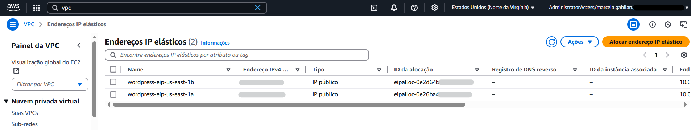

# Etapa 01 – Criar a Rede (VPC, Subnets, Rotas, NAT, IGW)

Nesta etapa foi criada a infraestrutura de rede do projeto WordPress na AWS, com base nas boas práticas de arquitetura em nuvem. Os recursos foram gerados automaticamente pelo assistente da AWS, garantindo separação de subnets públicas e privadas, distribuição em duas zonas de disponibilidade e alta disponibilidade de saída para a internet via NAT Gateway.

---

### 1.1 – Criar a VPC com subnets e NAT Gateway automaticamente

- Acesse o console da AWS > **VPC > Suas VPCs > Criar VPC**
- Selecione: ✅ **VPC e mais**
- **Geração automática da etiqueta de nome**: marque ✅
- **Nome base (etiqueta de nome)**: `wordpress`
- **Bloco CIDR IPv4**: `10.0.0.0/16`
- **Bloco CIDR IPv6**: Nenhum
- **Locação**: Padrão
- **Número de Zonas de Disponibilidade (AZs)**: `2`
- **Subnets**:
  - Serão criadas automaticamente:
    - `wordpress-subnet-public1-us-east-1a`
    - `wordpress-subnet-private1-us-east-1a`
    - `wordpress-subnet-public2-us-east-1b`
    - `wordpress-subnet-private2-us-east-1b`
- **Gateways NAT**: selecione ✅ **1 por AZ** (um para cada AZ)
- **Endpoints da VPC**: Nenhuma
- Clique em **Criar VPC**

> Essa opção criará automaticamente:
> - 1 VPC (`wordpress-vpc`)
> - 2 subnets públicas
> - 2 subnets privadas
> - 1 Internet Gateway
> - 2 NAT Gateways
> - 3 tabelas de rotas (1 pública e 2 privadas)

> ✅ **Importante**: Você **não precisa criar manualmente** os recursos abaixo:
> - Subnets
> - Internet Gateway (IGW)
> - NAT Gateway
> - Tabelas de rotas
> - Associação entre rotas e subnets

---

### 1.2 – Validar Subnets criadas automaticamente

- Acesse o console da AWS > **VPC > Sub-redes**
- Confirme que foram criadas **4 subnets**, com os seguintes nomes e configurações:

| Nome                                  | AZ         | Tipo     | CIDR           |
|---------------------------------------|------------|----------|----------------|
| wordpress-subnet-public1-us-east-1a  | us-east-1a | Pública  | 10.0.0.0/20    |
| wordpress-subnet-public2-us-east-1b  | us-east-1b | Pública  | 10.0.16.0/20   |
| wordpress-subnet-private1-us-east-1a | us-east-1a | Privada  | 10.0.128.0/20  |
| wordpress-subnet-private2-us-east-1b | us-east-1b | Privada  | 10.0.144.0/20  |

> ✅ Verifique se os **tipos das subnets** estão corretos: as públicas têm acesso à internet (via IGW), e as privadas não.

---

### 1.3 – Validar o Internet Gateway (IGW)

- Acesse: **VPC > Gateways da Internet**
- Nome: `wordpress-igw`
- Estado: **Attached**
- VPC associada: `wordpress-vpc`

> ✅ Certifique-se de que o IGW foi criado e está anexado corretamente à VPC.

---

### 1.4 – Validar Tabelas de Rotas

- Acesse: **VPC > Tabelas de rotas**
- Verifique se há **3 tabelas**:

| Nome                                 | Tipo de rota | Subnets associadas                     |
|--------------------------------------|--------------|----------------------------------------|
| wordpress-rtb-public                 | Pública      | 2 subnets públicas                     |
| wordpress-rtb-private1-us-east-1a    | Privada      | subnet privada us-east-1a              |
| wordpress-rtb-private2-us-east-1b    | Privada      | subnet privada us-east-1b              |

> Tabela de Rotas Padrão da VPC: `Principal = Sim`

- **Tabela pública**:
  - Rota: `0.0.0.0/0`
  - Alvo: Internet Gateway (`igw-xxxxxxx`)

- **Tabelas privadas**:
  - Rota: `0.0.0.0/0`
  - Alvo: NAT Gateway correspondente à AZ

> ✅ Certifique-se de que cada tabela privada usa o NAT da mesma AZ da subnet.

---

### 1.5 – Validar NAT Gateways e Elastic IPs

- Acesse: **VPC > Gateways NAT**
- Verifique se há **2 NAT Gateways** criados, um por AZ:

| Nome                              | Subnet vinculada                     | Elastic IP |
|-----------------------------------|--------------------------------------|------------|
| wordpress-nat-us-east-1a         | wordpress-subnet-public1-us-east-1a | ✔️         |
| wordpress-nat-us-east-1b         | wordpress-subnet-public2-us-east-1b | ✔️         |

- Acesse: **VPC > IPs Elásticos**
  - Devem existir **2 IPs alocados**, um para cada NAT

> ✅ Confirme que cada NAT está vinculado a uma subnet pública e com IP elástico.

---

✅ Rede criada com sucesso e validada. Pronta para receber os próximos recursos do projeto WordPress.