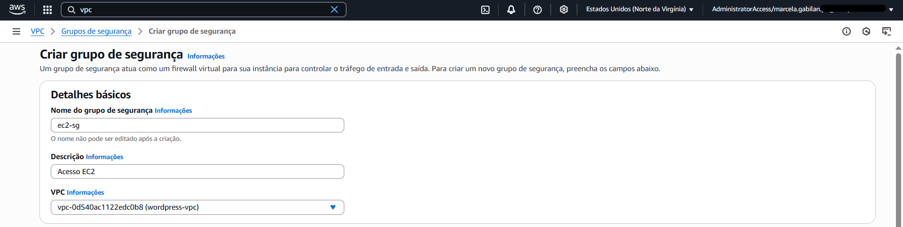
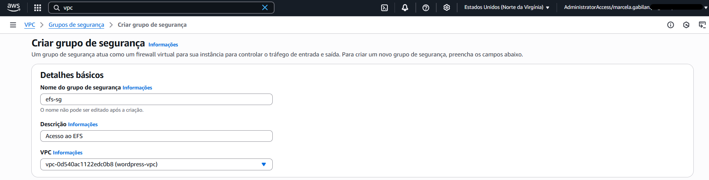
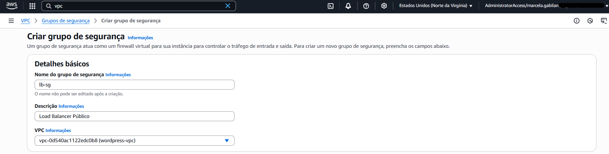
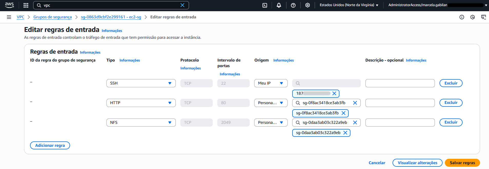
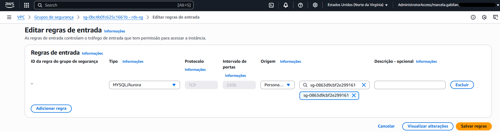
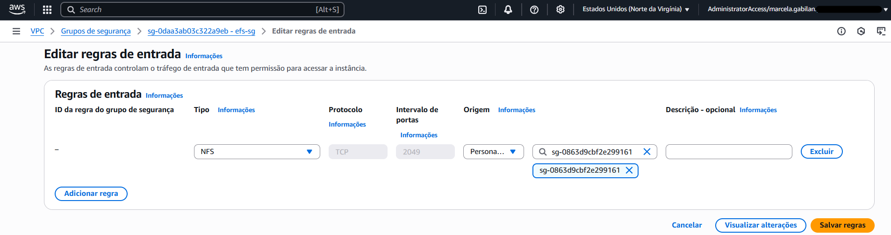
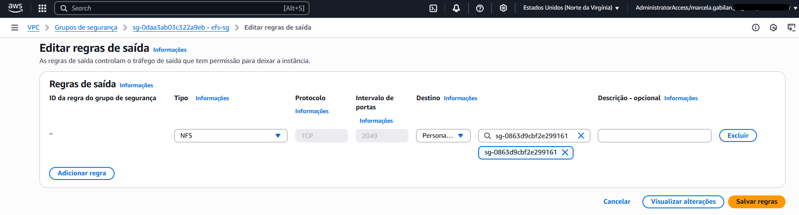
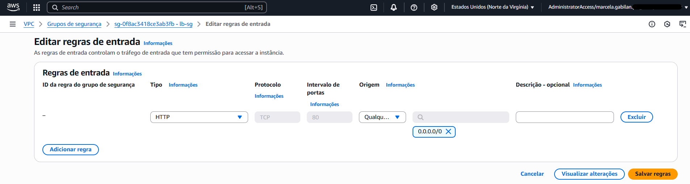

# Etapa 02 – Criar Grupos de Segurança (EC2, RDS, EFS e Load Balancer)

Nesta etapa, foram criados **4 Grupos de Segurança (SGs)**, cada um responsável por isolar e proteger um componente específico da arquitetura do projeto WordPress:

> - Instâncias EC2 (Subnets privadas)  
> - Banco de Dados RDS (Subnets privadas)  
> - Sistema de Arquivos EFS (Subnets privadas)  
> - Load Balancer (Subnets públicas)

---

### 1. Criar os Grupos de Segurança

1. Console AWS > **VPC > Grupos de segurança > Criar grupo de segurança**
2. Crie todos os 4 grupos indicados abaixo, **sem configurar regras neste momento**
3. Selecione a mesma **VPC criada na Etapa 01** para todos os grupos

### 🔐 `ec2-sg` – Instâncias EC2

- **Nome:** `ec2-sg`
- **Descrição:** Acesso EC2
- **VPC:** `wordpress-vpc`

### 🔐 `rds-sg` – Banco de Dados (MySQL RDS)

- **Nome:** `rds-sg`
- **Descrição:** Acesso ao RDS
- **VPC:** `wordpress-vpc`

### 🔐 `efs-sg` – Elastic File System

- **Nome:** `efs-sg`
- **Descrição:** Acesso ao EFS
- **VPC:** `wordpress-vpc`

### 🔐 `lb-sg` – Load Balancer (Application LB)

- **Nome:** `lb-sg`
- **Descrição:** Load Balancer Publico
- **VPC:** `wordpress-vpc`

---

### 2. Configurar as Regras dos Grupos de Segurança

Após criar os 4 grupos de segurança, siga os passos abaixo para configurar as **regras de entrada e saída**:

1. Acesse o console da AWS > **VPC > Grupos de segurança**.  
2. **Selecione** um dos grupos de segurança criados.  
3. Clique na aba **“Regras de entrada”** > **Editar regras de entrada**.  
4. Adicione as regras conforme a tabela correspondente e clique em **Salvar regras**.  
5. Em seguida, vá para **“Regras de saída”** > **Editar regras de saída**.  
6. Adicione as regras necessárias e salve novamente.

> 🔁 Repita esse processo para todos os grupos: `ec2-sg`, `rds-sg`, `efs-sg` e `lb-sg`.

### 🔐 `ec2-sg` – Instâncias EC2

📥 **Regras de Entrada**

| Tipo | Porta | Origem   | Motivo                               |
|------|-------|----------|--------------------------------------|
| SSH  | 22    | Seu IP   | Acesso para depuração                |
| HTTP | 80    | lb-sg    | Receber tráfego do Load Balancer     |
| NFS  | 2049  | efs-sg   | Acesso ao sistema de arquivos EFS    |

📤 **Regras de Saída**

| Tipo        | Porta | Destino   | Motivo                                                              |
|-------------|-------|-----------|---------------------------------------------------------------------|
| Todo o tráfego | Todos | 0.0.0.0/0 | Acesso à internet via NAT Gateway para atualizações e conexão com RDS |

### 🔐 `rds-sg` – Banco de Dados

📥 **Regras de Entrada**

| Tipo           | Porta | Origem  | Motivo                          |
|----------------|-------|---------|---------------------------------|
| MySQL/Aurora   | 3306  | ec2-sg  | Permitir acesso da aplicação    |

📤 **Regras de Saída**

| Tipo           | Porta | Destino | Motivo                                            |
|----------------|-------|---------|---------------------------------------------------|
| MySQL/Aurora   | 3306  | ec2-sg  | Comunicação bidirecional com EC2 (boas práticas)  |

### 🔐 `efs-sg` – Sistema de Arquivos

📥 **Regras de Entrada**

| Tipo | Porta | Origem | Motivo                     |
|------|-------|--------|----------------------------|
| NFS  | 2049  | ec2-sg | Permitir montagem do EFS   |

📤 **Regras de Saída**

| Tipo | Porta | Destino | Motivo                     |
|------|-------|---------|----------------------------|
| NFS  | 2049  | ec2-sg  | Comunicação bidirecional   |

### 🔐 `lb-sg` – Load Balancer

📥 **Regras de Entrada**

| Tipo | Porta | Origem     | Motivo                         |
|------|-------|------------|--------------------------------|
| HTTP | 80    | 0.0.0.0/0  | Receber tráfego da internet    |

📤 **Regras de Saída**

| Tipo | Porta | Destino | Motivo                              |
|------|-------|---------|-------------------------------------|
| HTTP | 80    | ec2-sg  | Redirecionar tráfego para instâncias |

---

### ✅ Verificando os grupos criados

---

📌 **Observações importantes:**

- Os 4 grupos foram criados **antes** da definição das regras para que todas as referências cruzadas funcionem corretamente.
- A regra SSH foi adicionada **apenas para depuração**, e pode ser removida após os testes.
- As configurações seguem **boas práticas** da AWS para ambientes privados com Load Balancer e EFS.