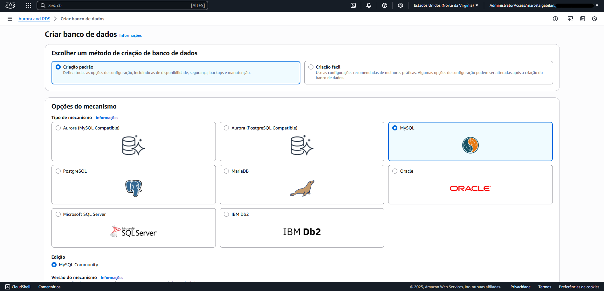
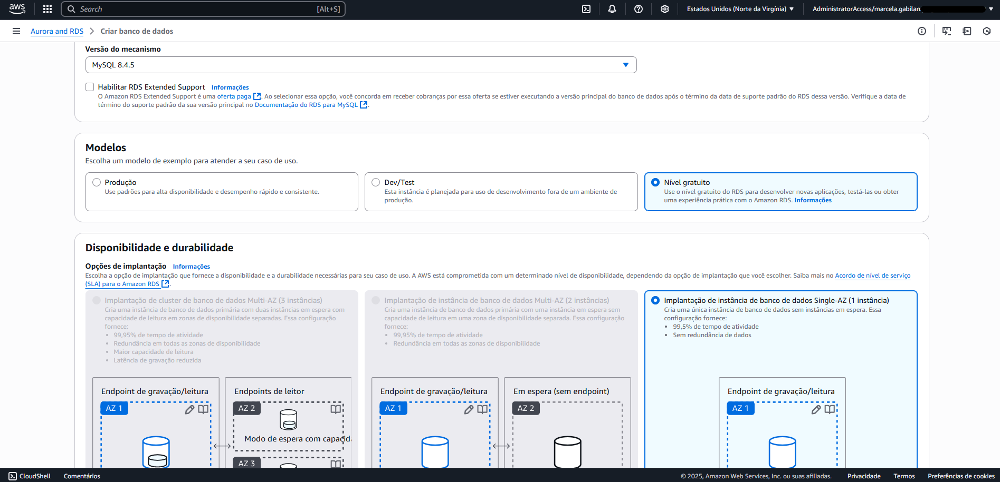
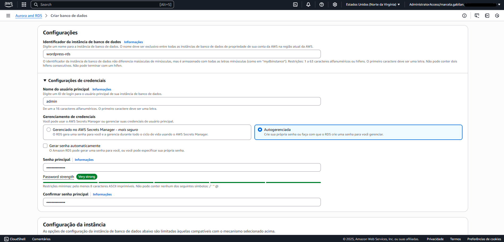
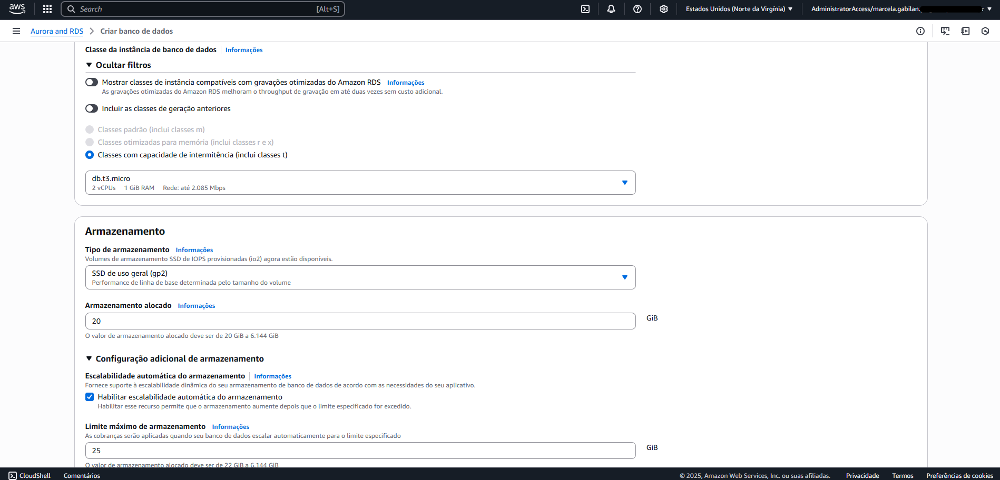
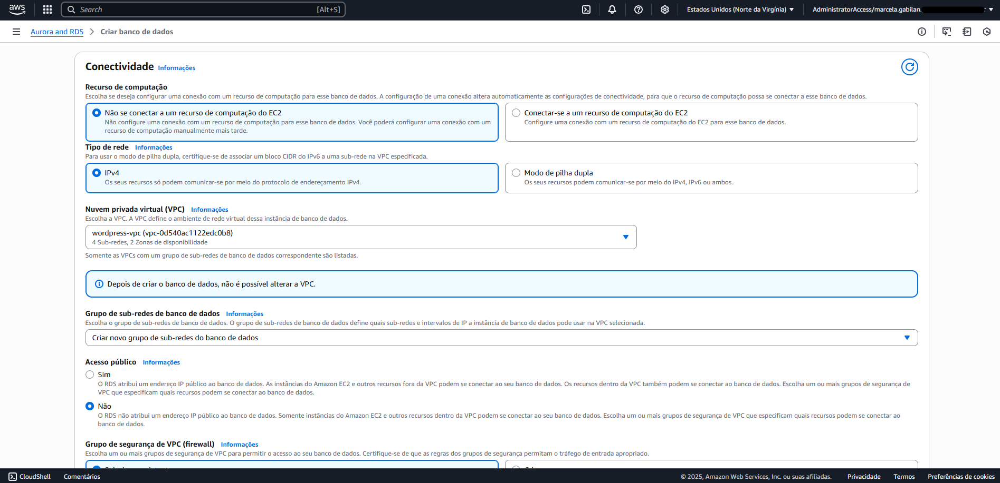
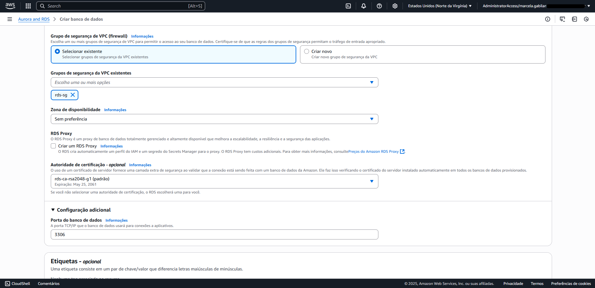
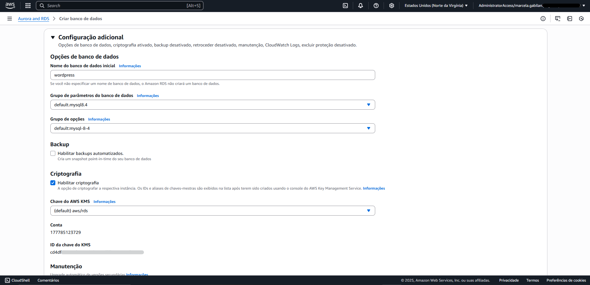
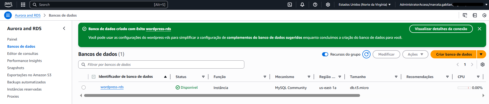

# Etapa 03 – Criar o Banco de Dados (RDS)

Nesta etapa, será criada uma instância **MySQL RDS** para armazenar os dados do WordPress. O banco será privado, acessado apenas pela EC2 nas subnets privadas, conforme boas práticas da AWS.

---

## 1. Acessar o RDS

- Acesse o console da AWS  
- Pesquise por **RDS**  
- Vá em **Banco de dados > Criar banco de dados**  
- Modo de criação: ✅ **Padrão (Standard Create)**

## 2. Criar o RDS

### Configurações do Mecanismo

- Engine: ✅ **MySQL**
- Versão: ✅ **Mais recente disponível**
- Modelo: ✅ **Free tier**
- Implantação: ✅ **Single-AZ (1 instância)**

### Identificação e Credenciais

- Nome da instância: `wordpress-rds`
- Nome do banco: `wordpress`
- Usuário mestre: `admin`
- Gerenciamento de senha: ✅ **Autogerenciada**
- Senha: `<sua-senha>` (uma senha segura)
- Confirmar senha

### Instância e Armazenamento

- Tipo: `db.t3.micro`
- Armazenamento: `gp2`, 20 GiB
- Escalabilidade automática: **Habilitar**
- Limite máximo de armazenamento: 25 GiB

### Rede e Conectividade

- EC2: ❌ **Não conectar**
- Tipo de rede: IPv4
- VPC: `wordpress-vpc`
- Subnet group: ✅ Criar novo
- Acesso público: ❌ Não
- Grupo de segurança: ✅ `rds-sg`
- Porta: `3306`

### Backup e Finalização

- Backup automatizado: ❌ **Desabilitar**
- Clique em **Criar banco de dados**

---

## ✅ Verificação

- Acesse **RDS > Bancos de dados**
- Verifique se o status está como ✅ **Disponível**
- Verifique se o banco está **privado**, com SG e VPC corretos

---

## ℹ️ Observações

- Banco acessível apenas via **EC2** com SG configurado (etapa 2)
- Backup desabilitado para evitar cobranças
- Informações como senha e endpoint serão usadas depois no `docker-compose.yml`