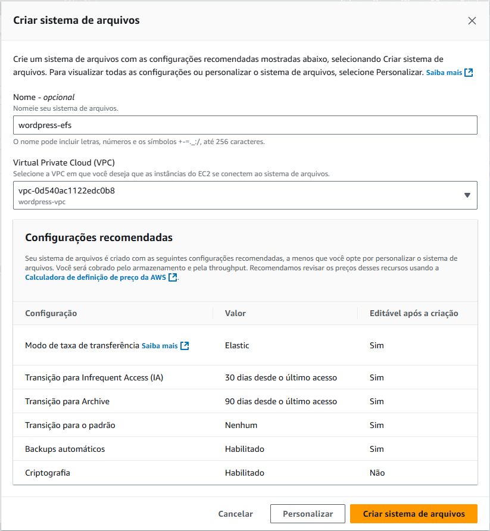
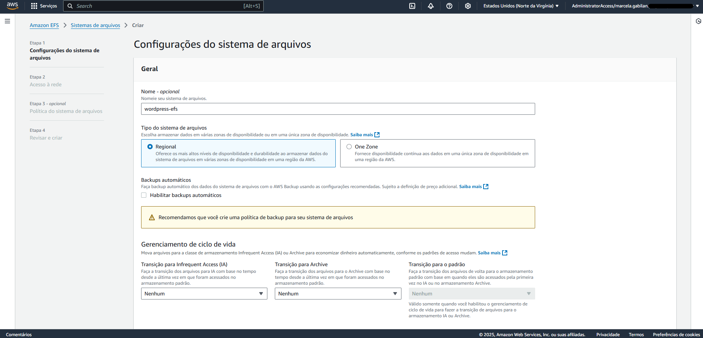
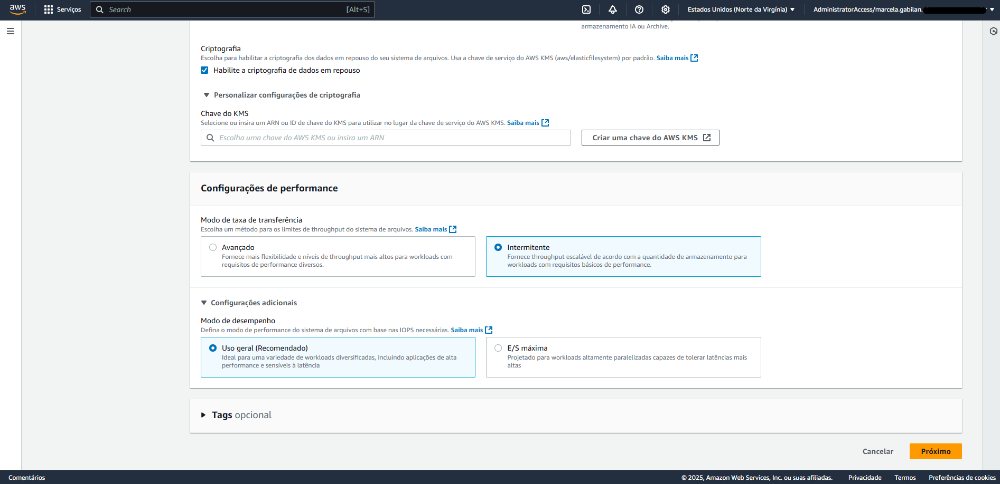
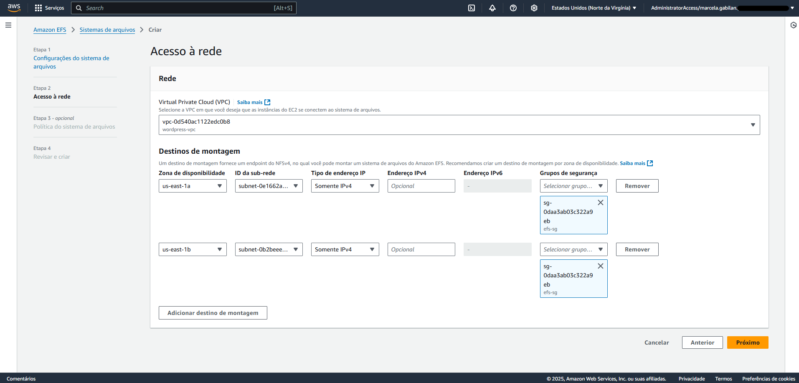
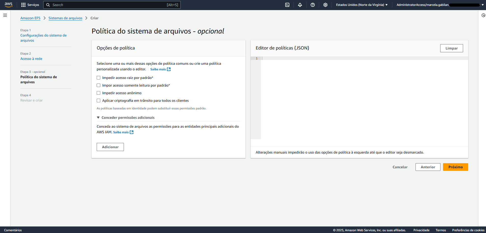
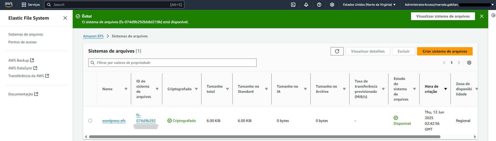
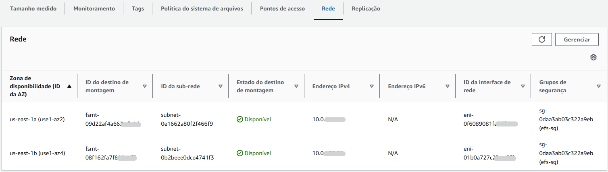

# Etapa 04 – Criar o Sistema de Arquivos (EFS)

Nesta etapa, será criado um sistema de arquivos compartilhado **Amazon EFS**, que permitirá o armazenamento de arquivos estáticos do WordPress (como imagens, plugins e temas). O EFS será acessado pelas instâncias EC2 nas subnets privadas.

---

### Criar Sistema de Arquivos (EFS)

1. Acesse o console da AWS > pesquise por **EFS** > clique em **Sistemas de arquivos**
2. Clique em **Criar sistema de arquivos**
3. Informe os seguintes dados:

- **Nome do sistema de arquivos:** `wordpress-efs`
- **VPC:** `wordpress-vpc`
- Clique em: **"Personalizar"**

- **Tipo de sistema de arquivos:** `Regional`
- **Desmarque** a opção **"Habilitar backups automáticos"**
- **Gerenciamento de ciclo de vida:** Marcar **Nenhum** para todos
- **Modo de taxa de transferência:** `Intermitente`
- **Modo de desempenho:** `Uso geral`

---

### Configurar as Redes

1. Selecione as **subnets privadas** da sua VPC:
   - `wordpress-subnet-private1-us-east-1a`
   - `wordpress-subnet-private2-us-east-1b`
2. Selecione o **grupo de segurança do EFS**: `efs-sg`
3. Clique em **Avançar** até a revisão final
4. Clique em **Criar**

---

### Validar EFS Criado

1. Após a criação, clique em `wordpress-efs`
2. Vá até a aba **Redes** e verifique se os pontos de montagem estão com status **Disponível**
3. Anote o **ID do sistema de arquivos** (ex: `fs-xxxxxxxx`) — ele será utilizado no **script de inicialização da EC2 (UserData)**

---

📌 **Observações importantes:**

- O **EFS permite múltiplas EC2 compartilharem os mesmos arquivos** simultaneamente, garantindo consistência para uploads e atualizações do WordPress.
- O ponto de montagem será feito mais adiante na configuração do script `UserData` da EC2.