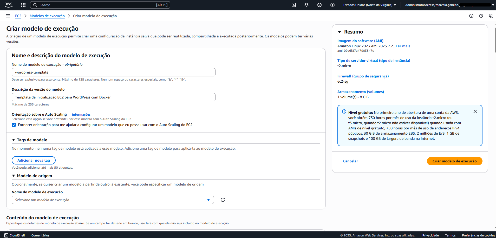
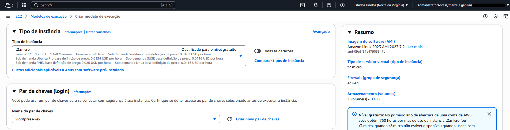
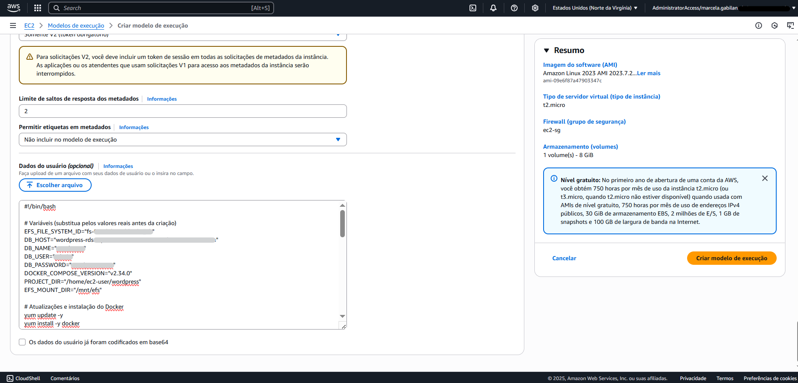
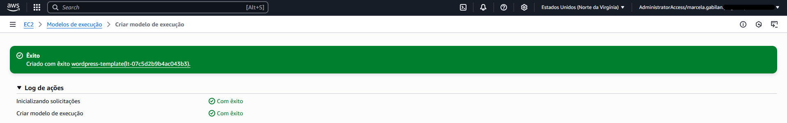
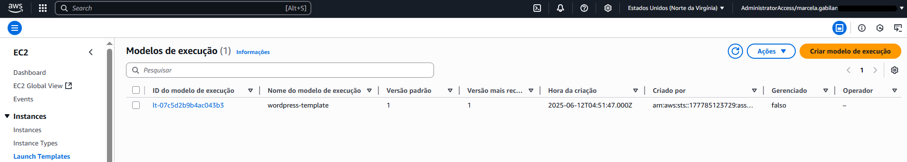

# Etapa 05 – Launch Template e EC2 com Docker

Nesta etapa, será criado um **Launch Template** para inicializar instâncias EC2 automaticamente com configurações pré-definidas, incluindo:
- Subnet privada
- Instalação automática via User Data:
  - Docker
  - Docker Compose
  - Montagem do EFS
  - Implantar o WordPress via Docker Compose

> O sistema operacional utilizado será o **Amazon Linux 2023**, com adaptação dos comandos para essa versão.

---

### 5.1 Criar Template de Inicialização (Launch Template)

1. Console AWS > **EC2 > Launch Templates > Criar modelo de execução**

2. **Nome:** `wordpress-template`  
3. **Descrição:** Template de inicializacao EC2 para WordPress com Docker  
4. Marque a opção `Fornecer orientação para me ajudar a configurar um modelo que eu possa usar com o Auto Scaling do EC2`



#### Sistema operacional
5. **AMI:** Selecione `Amazon Linux 2023 AMI`  
6. **Tipo de instância:** `t2.micro`  
7. **Chave de acesso (Key Pair):** Selecione sua chave existente (ex: `wordpress-key`)




#### Rede e Segurança
8. Subnet: `Não incluir no modelo de execução`  
9. Grupo de segurança: `Selecionar existente > ec2-sg`


#### Tags de recurso
10. Clique em `Add new tag` e insira suas tags obrigatórias  
> 🔐 **Importante:** Por segurança, **os valores reais das tags não são incluídos na documentação**.

#### Script de inicialização (User Data)
11. Cole o script abaixo em **Detalhes avançados > User Data**:

```bash
#!/bin/bash

# Variáveis (substitua pelos valores reais antes da criação)
EFS_FILE_SYSTEM_ID="<id_efs>"
DB_HOST="<endpoint_rds>"
DB_NAME="<nome_bd>"
DB_USER="<usuario_bd>"
DB_PASSWORD="<senha_bd>"
DOCKER_COMPOSE_VERSION="v2.34.0"
PROJECT_DIR="/home/ec2-user/wordpress"
EFS_MOUNT_DIR="/mnt/efs"

# Atualizações e instalação do Docker
yum update -y
yum install -y docker
systemctl start docker
systemctl enable docker
usermod -aG docker ec2-user

# Instala Docker Compose
curl -SL https://github.com/docker/compose/releases/download/${DOCKER_COMPOSE_VERSION}/docker-compose-linux-x86_64 -o /usr/local/bin/docker-compose
chmod +x /usr/local/bin/docker-compose

# Instala e monta o EFS
yum install -y amazon-efs-utils
mkdir -p ${EFS_MOUNT_DIR}
mount -t efs ${EFS_FILE_SYSTEM_ID}:/ ${EFS_MOUNT_DIR}
echo "${EFS_FILE_SYSTEM_ID}:/ ${EFS_MOUNT_DIR} efs defaults,_netdev 0 0" >> /etc/fstab

# Permissões para WordPress
chown -R 33:33 ${EFS_MOUNT_DIR}

# Prepara o projeto
mkdir -p ${PROJECT_DIR}
cd ${PROJECT_DIR}

# Cria docker-compose.yml
cat > docker-compose.yml <<EOL
version: '3.7'
services:
  wordpress:
    image: wordpress:latest
    container_name: wordpress
    environment:
      WORDPRESS_DB_HOST: ${DB_HOST}
      WORDPRESS_DB_NAME: ${DB_NAME}
      WORDPRESS_DB_USER: ${DB_USER}
      WORDPRESS_DB_PASSWORD: ${DB_PASSWORD}
    ports:
      - 80:80
    volumes:
      - ${EFS_MOUNT_DIR}:/var/www/html
EOL

# Inicializa WordPress
docker-compose up -d
```

> ℹ️ **Observação:** Substitua os valores entre `<...>` antes de aplicar o template.




### ✅ Verificações importantes

- Verifique se o template aparece na listagem.
- Clique sobre ele e acesse a aba **User Data** para confirmar se o script foi salvo corretamente.
- Verifique se os campos como **AMI**, **Security Group** e **Key Pair** estão corretos.



---

### 📌 Observações finais

- O **Amazon Linux 2023** usa `yum` como gerenciador de pacotes.
- O comando `systemctl enable docker` garante que o serviço do Docker seja reiniciado automaticamente com a instância.