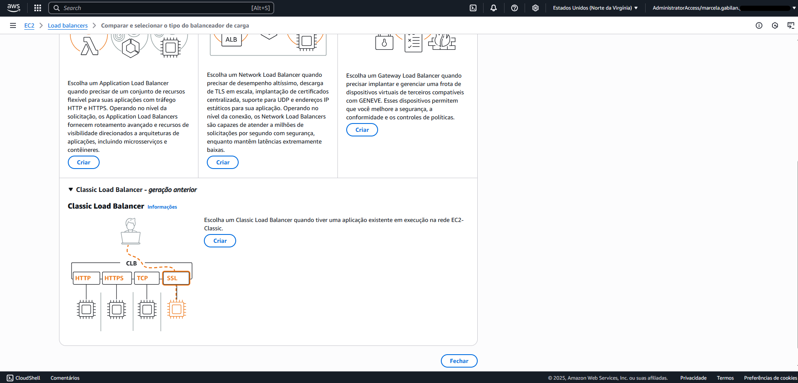
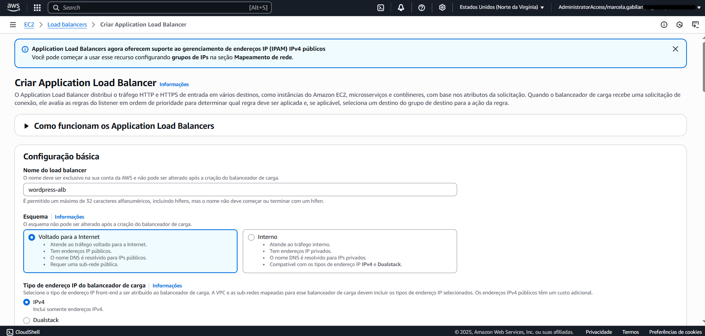
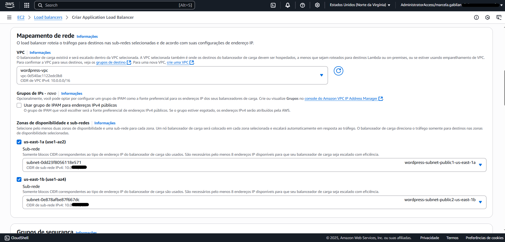
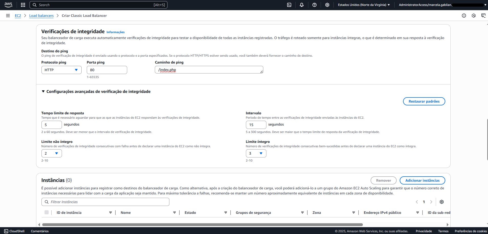
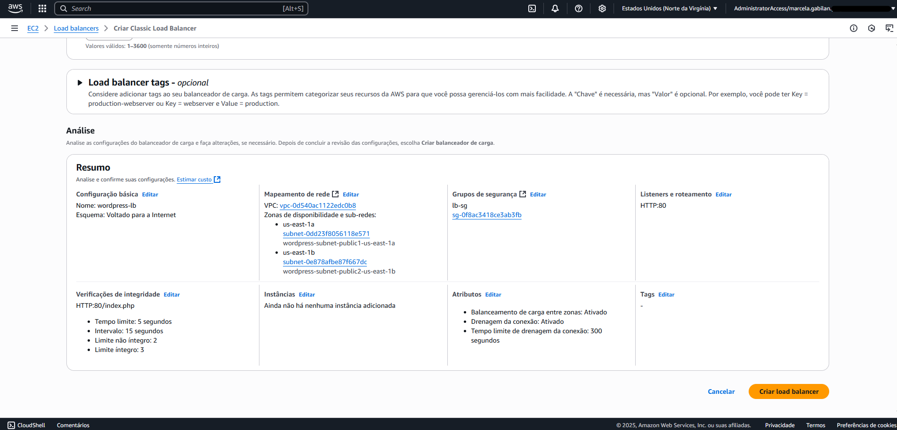
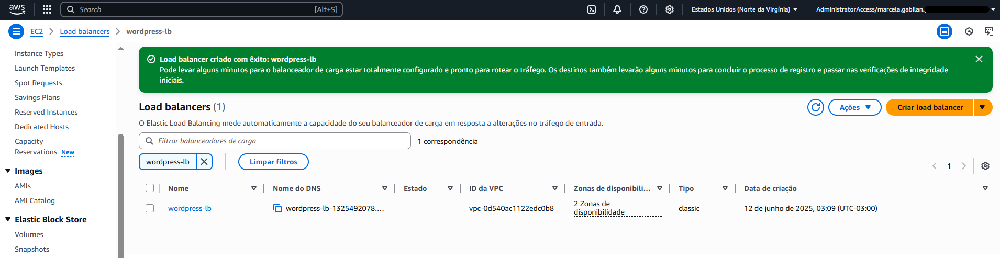

# Etapa 06 – Criar o Load Balancer (Classic LB)

Nesta etapa, será criado um **Classic Load Balancer** que distribuirá o tráfego entre as instâncias EC2. Ele garantirá:
- Alta disponibilidade entre múltiplas zonas de disponibilidade
- Monitoramento da integridade das instâncias
- Redirecionamento automático em caso de falha

---

### 1. Acessar o serviço de Load Balancer

1. Acesse o console da AWS > EC2
2. No menu à esquerda, clique em **Load balancers**
3. Clique no botão **Criar Load balancer**

### 2. Escolher tipo de Load Balancer

1. Clique para **expandir** a seção do **Classic Load Balancer – geração anterior**
2. Selecione **Classic Load Balancer**
3. Clique em **Criar**

### 3. Configuração do Load Balancer

1. **Nome do balanceador de carga:** `wordpress-lb`
2. **Esquema:** Selecione **Voltado para a Internet**
3. **VPC:** Selecione a **VPC wordpress-vpc** criada na Etapa 01

### 4. Selecionar zonas de disponibilidade

1. Marque as zonas **us-east-1a** e **us-east-1b**
2. Em cada zona, selecione a **sub-rede pública** correspondente:
   - `wordpress-subnet-public1-us-east-1a`
   - `wordpress-subnet-public2-us-east-1b`
3. Grupos de segurança: `lb-sg`

### 5. Configurar verificação de integridade (Health checks)

1. Caminho de ping: `/index.php`
2. Tempo limite de resposta: `5` segundos
3. Intervalo de verificação: `15` segundos
4. Tentativas com falha: `2`
5. Tentativas bem-sucedidas: `3`

> ℹ️ O arquivo `/index.php` está presente na raiz do WordPress e é ideal para verificar se o site está ativo.

### 6. Finalizar a criação do Load Balancer

1. Clique em **Criar Load balancer**

---

### ✅ Verificações obrigatórias

- Verifique se o Load Balancer foi criado com sucesso
- Verifique se as **zonas de disponibilidade**, **VPC** e **sub-redes públicas** estão corretas
- Confirme que o **caminho de verificação de integridade** foi definido como `/index.php`

---

### 📌 Observações finais:

- O **Classic Load Balancer (CLB)** não utiliza **Target Group**, diferente do Application Load Balancer (ALB). Portanto, não é necessário criar Target Group nesta etapa.

- O **estado do Load Balancer ficará como “—”** até que uma instância EC2 esteja registrada e saudável, o que ocorrerá após a criação do Auto Scaling Group, na próxima etapa.

- O caminho de verificação de integridade (Health Check) foi configurado para `/index.php`, pois é o ponto de entrada principal da aplicação WordPress. Se preferir, é possível usar `/` também.
