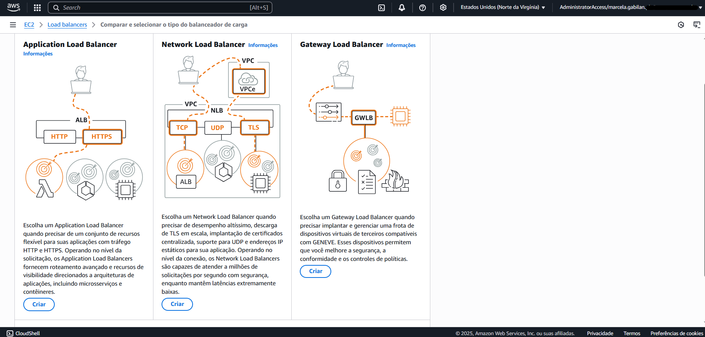
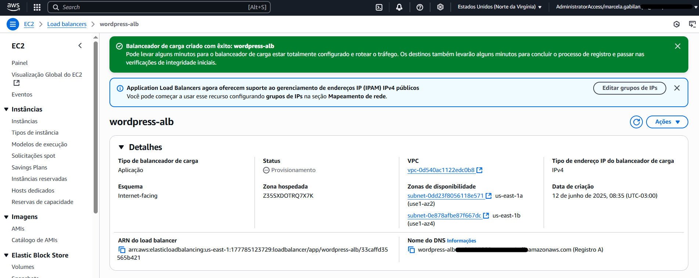

# Etapa 06 – Criar o Load Balancer (Application LB)

Nesta etapa, será criado um **Application Load Balancer** que distribuirá o tráfego entre as instâncias EC2. Ele garantirá:
- Alta disponibilidade entre múltiplas zonas de disponibilidade
- Monitoramento da integridade das instâncias
- Redirecionamento automático em caso de falha

---

### 1. Acessar o serviço de Load Balancer

1. Acesse o console da AWS > EC2
2. No menu à esquerda, clique em **Load balancers**
3. Clique no botão **Criar Load balancer**

### 2. Escolher tipo de Load Balancer

1. Selecione **Application Load Balancer**
2. Clique em **Criar**

### 3. Configuração do Load Balancer

1. **Nome do balanceador de carga:** `wordpress-alb`
2. **Esquema:** Selecione **Voltado para a Internet**

### 4. Selecionar zonas de disponibilidade

1. **VPC:** Selecione a **VPC wordpress-vpc** criada na Etapa 01
2. Marque as zonas **us-east-1a** e **us-east-1b**
3. Em cada zona, selecione a **sub-rede pública** correspondente:
   - `wordpress-subnet-public1-us-east-1a`
   - `wordpress-subnet-public2-us-east-1b`

### 5. Configurar roteamento

1. Grupos de segurança: `lb-sg`
2. Protocolo: **HTTP**
3. Porta: **80**
4. Ação Padrão (Target Group): `wordpress-tg`

> ℹ️ O arquivo `/index.php` está presente na raiz do WordPress e é ideal para verificar se o site está ativo.

### 6. Finalizar a criação do Load Balancer

1. Clique em **Criar Load balancer**

---

## > Criar o Target Group

1. Na tela de criação do Application Load Balancer, em **Listeners e roteamento**

2. Clique em **Criar grupo de destino**

