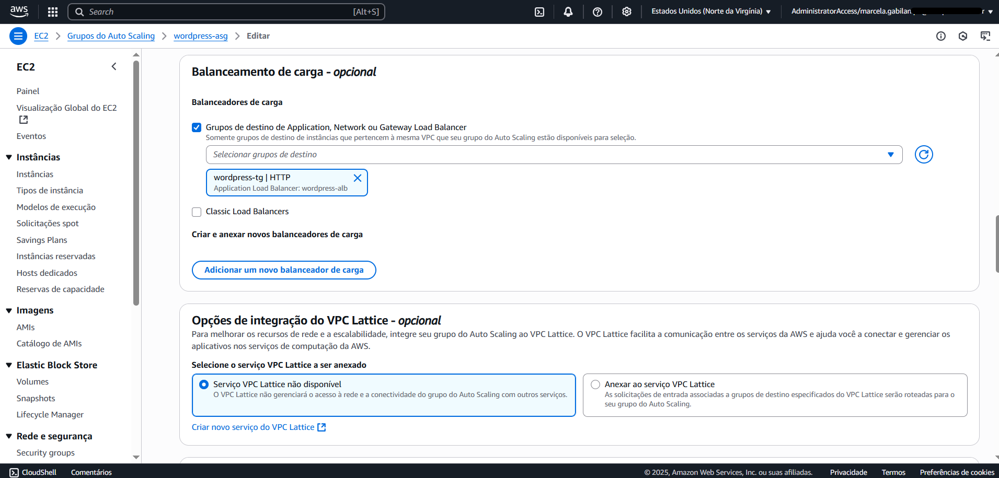
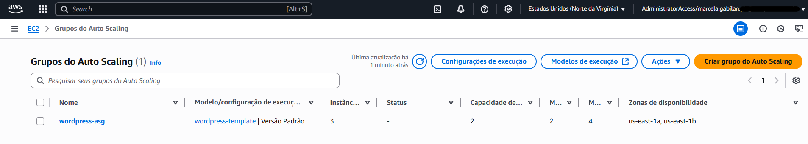

# Etapa 07 – Criar o Auto Scaling Group (ASG)

Nesta etapa, será criado um **Auto Scaling Group (ASG)** que irá garantir a **alta disponibilidade** e **escalabilidade automática** do WordPress. O ASG será responsável por criar, remover e balancear instâncias EC2 conforme a demanda, utilizando o **Launch Template** criado anteriormente.

---

### 1. Criar o Auto Scaling Group

1. Acesse o console da AWS > EC2
2. No menu à esquerda, clique em **Auto Scaling Groups**
3. Clique no botão **Criar grupo de auto scaling**

### 2. Configurar o ASG

- **Nome:** `wordpress-asg`
- **Launch Template:** selecione o que foi criado (ex: `wordpress-template`)
- **Versão:** `Default (padrão)`
- Clique em **Avançar**

### 3. Configurar rede e sub-redes

- **VPC:** selecionar `wordpress-vpc`
- **Subnets:** selecionar as **duas subnets privadas**
- **Opção de balanceamento:** `Melhor esforço equilibrado`
- Clique em **Avançar**

### 4. Associar ao Load Balancer

- Selecione: **Associar a um Load Balancer existente**
- Tipo: `Classic Load Balancer`
- Selecione o **Load Balancer** criado na etapa 6 - `wordpress-lb`
- Clique em **Avançar**

### 5. Verificações de integridade

- Marcar: `Ative as verificações de integridade do Elastic Load Balancing`
- Health check grace period: manter `300` segundos
- Clique em **Avançar**

### 6. Capacidade desejada (número de instâncias)

- **Capacidade desejada (Desired):** `2`
- **Mínimo (Min):** `2`
- **Máximo (Max):** `4`
- Selecionar: **Sem políticas de escalabilidade por enquanto**

### 7. Monitoramento (CloudWatch)

- Marcar a opção: `Habilitar coleta de métricas no CloudWatch`
- Clique em **Avançar** até etapa 7 **Análise**

### 8. Revisar e criar

- Revise todas as informações
- Clique em **Criar grupo de escalabilidade automática**

---

### ✅ Observações finais

- O Auto Scaling Group utilizará o **Launch Template** com User Data que instala e inicia o WordPress automaticamente.
- As **políticas de escalabilidade (Scaling Policies)** serão criadas na **Etapa 08 – CloudWatch**.
- O ASG manterá **duas instâncias sempre ativas** e poderá escalar até **quatro instâncias**, conforme definido nesta etapa.
