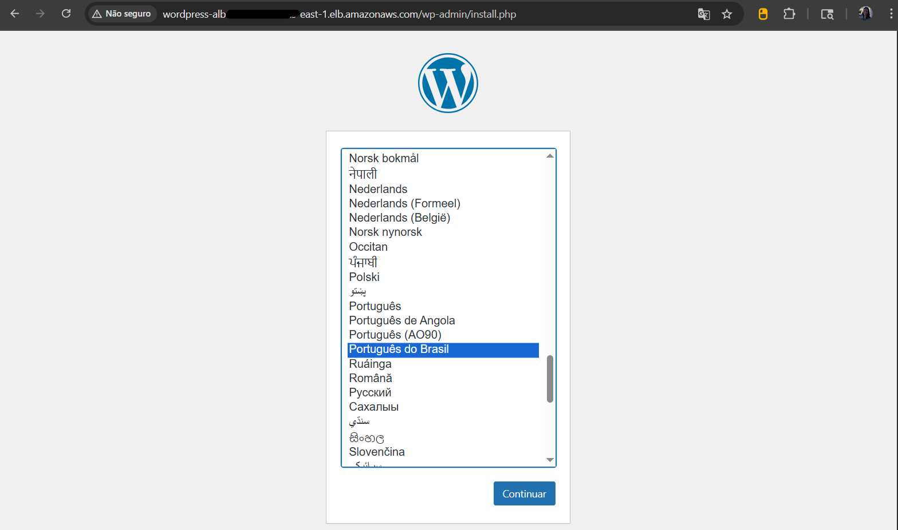
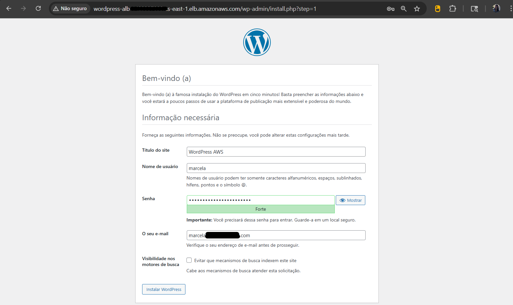
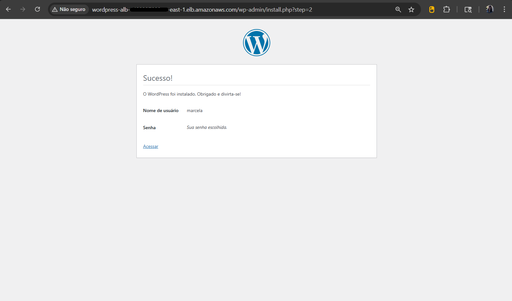
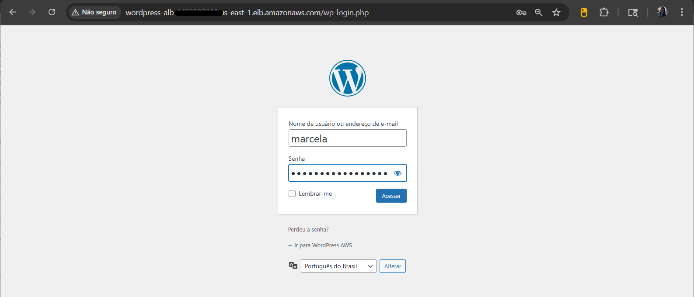
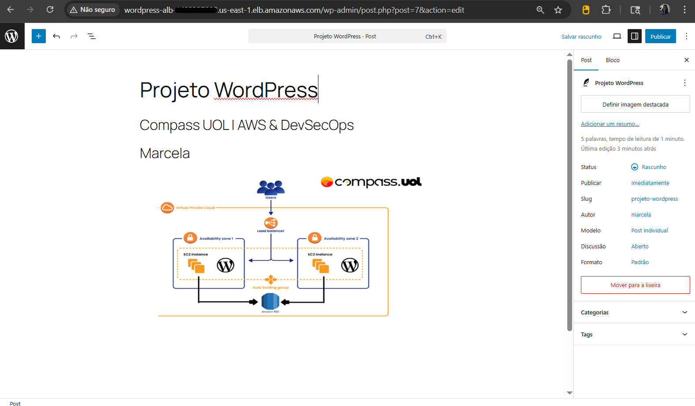
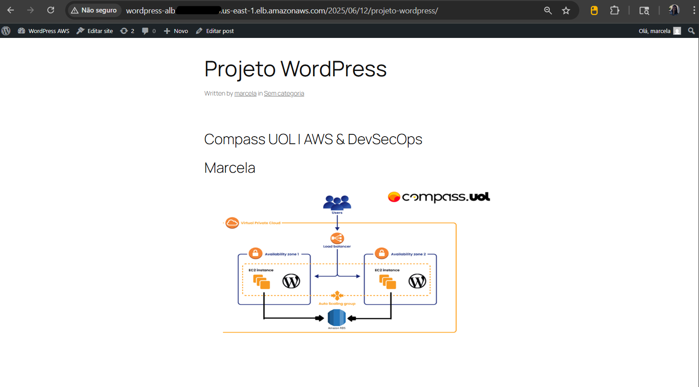

## ✅ Etapa 08 – Testes da Infraestrutura

Nesta etapa, foram realizados testes para validar o correto funcionamento da aplicação WordPress implantada na infraestrutura AWS. Os testes confirmam que todos os componentes estão integrados e funcionando conforme esperado.

---

### 🔍 Testes realizados

1. **Acesso à aplicação via navegador**  
   Através do DNS público do Application Load Balancer, foi possível acessar o instalador do WordPress com sucesso.

   

2. **Instalação e login no WordPress**  
   A instalação foi concluída preenchendo os dados do site, nome de usuário, senha e e-mail. Após a instalação, foi possível realizar o login normalmente no painel administrativo do WordPress.

   
   
   

3. **Criação e publicação de um post**  
   Foi criado um post simples com título e uma imagem enviada através do painel.  
   ✅ O post foi publicado com sucesso e pôde ser acessado externamente, validando a persistência via Amazon EFS e a conexão com o banco de dados RDS.




---

### 🔗 Endereço de acesso

A aplicação foi acessada através do **DNS do Application Load Balancer** (exemplo):

```txt
http://wordpress-lb-1234567890.us-east-1.elb.amazonaws.com
```
> **Obs:** o DNS acima é apenas um exemplo. No teste real, foi utilizado o DNS gerado automaticamente ao criar o Load Balancer na AWS.

## 🧪 Validação da infraestrutura
- ✅ Balanceamento de carga: com o Application Load Balancer configurado corretamente, o tráfego foi distribuído entre as instâncias do Auto Scaling Group.

- ✅ Conexão com o RDS: a aplicação armazenou e recuperou dados no banco de forma consistente.

- ✅ Persistência com o EFS: arquivos enviados ao WordPress ficaram disponíveis, mesmo em reinicializações.

- ✅ Escalabilidade: a estrutura está pronta para escalar horizontalmente, conforme o ajuste do Auto Scaling.